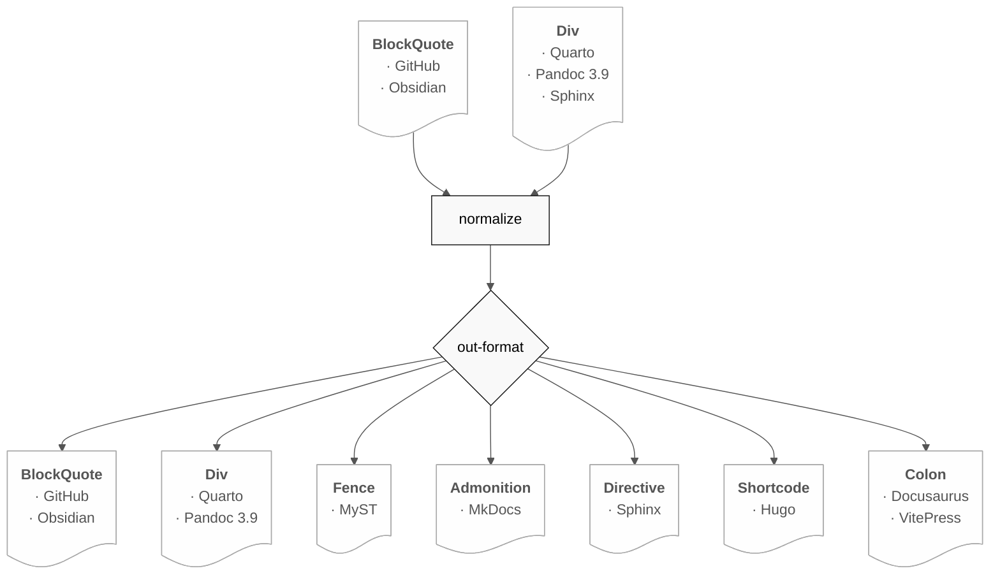

# alerts-normalize.lua

[](https://github.com/plbarrio/alerts-normalize/actions/workflows/test.yml)
[](https://www.gnu.org/licenses/gpl-3.0)
[](https://pandoc.org)
[](https://quarto.org)

Pandoc Lua filter that normalizes alert and callout syntax across formats.
It reads GitHub-style blockquotes (`> [!NOTE]`), Quarto callouts (`:::{.callout-note}`),
and Pandoc 3.9 classed divs (`:::{.note}`) into a unified intermediate representation,
then writes them in the chosen target format.

Copyright 2026 Pedro Luis Barrio under GPL-3.0-or-later, see LICENSE file for details.
Maintained by [plbarrio](https://github.com/plbarrio).

## Requirements

Pandoc >= 2.19.1 · Quarto >= 1.4.0 (for Quarto usage)

## Installation

### Quarto extension (recommended)

```sh
quarto add plbarrio/alerts-normalize
```

Declare in `_quarto.yml` at the `pre-ast` stage — required so the filter
runs before Quarto's callout processor:

```yaml
filters:
  - at: pre-ast
    path: plbarrio/alerts-normalize
```

### Plain Pandoc

```sh
pandoc --lua-filter=alerts-normalize.lua input.md -o output.html
```

> [!NOTE]
> The file `alerts-normalize.lua` at the repo root is a symlink to
> `_extensions/alerts-normalize/alerts-normalize.lua`.
> Plain Pandoc users reference the root symlink; Quarto users install via
> `quarto add` which uses `_extensions/` directly.

## How it works

The filter operates in two stages:

**Stage 1 — Normalize** reads any supported input format and converts it to
an intermediate `pandoc-md` representation: a plain classed div with an optional
`title` attribute and `collapse` attribute.

**Stage 2 — Write** converts the intermediate div to the chosen output format.



### Readable formats (Stage 1)

| Format | Syntax |
|---|---|
| GitHub / Obsidian | `> [!NOTE]` |
| Quarto | `:::{.callout-note}` |
| Pandoc 3.9 / Sphinx | `:::{.note}` + optional `.title` child |

### Output formats (Stage 2)

| Key | Syntax | Title | Collapse |
|---|---|---|---|
| `quarto-format` | `:::{.callout-note}` | ✓ | ✓ |
| `pandoc-format` | `:::{.note}` + `.title` child | ✓ | — |
| `pandoc-md` | `:::{.note title="..."}` | ✓ | ✓ |
| `github-format` | `> [!NOTE]` | ✓ | ✓ |
| `obsidian-format` | `> [!NOTE]` | ✓ | ✓ |
| `mkdocs-format` | `!!! note` | ✓ | ✓ (`???`) |
| `myst-format` | ` ```{note} ` | ✓ | ✓ (`dropdown`) |
| `sphinx-format` | `.. note::` | ✓ | — |
| `hugo-format` | `` | — | — |
| `docusaurus-format` | `:::note` | ✓ | ✓ (`:::details`) |
| `vitepress-format` | `:::NOTE` | ✓ | ✓ (`:::details`) |

Write-only formats (MkDocs, MyST, Sphinx, Hugo, Docusaurus, VitePress) have no
reader — their syntax collapses to plain paragraphs in the Pandoc AST.

## Markdown syntax

Any casing is accepted. Inline title and collapse markers are supported:

```markdown
> [!NOTE]
> Standard note, no title.

> [!Note] My custom title
> Title on the marker line.

> [!WARNING]-
> Starts collapsed.

> [!TIP]+
> Starts explicitly expanded.

> [!SPOILER]
> Custom type — any word is accepted.
```

Pandoc 3.9 and Quarto source divs are also read:

```markdown
::: {.note title="My title" collapse="true"}
Content here.
:::

:::{.callout-warning}
Quarto callout — no title needed.
:::
```

## Configuration


### Simple form

The simplest form works on the command line and in frontmatter:

```sh
pandoc --lua-filter=alerts-normalize.lua \
       --metadata alerts-normalize=github-format \
       input.md -o output.md
```

```yaml
---
alerts-normalize: github-format
---
```

### Nested form (custom types, remapping)

For additional options, use the nested form in a metadata file or frontmatter:

```yaml
alerts-normalize:
  out-format: pandoc-format
  custom-types:
    - spoiler
    - exercise 
    - info : note # remap info -> note
```

* `out-format` — chooses the output format. Auto-detected when omitted: `quarto-format` inside Quarto, `pandoc-format` otherwise.

* `custom-types` — extends the built-in callout whitelist; supports **remapping** (`source: target`) and new types.


## Output

### Plain Pandoc (`pandoc-format`)

Produces classed divs that match the pandoc 3.9 native alert AST.
Title is only inserted when explicitly set by the user — no auto-generation:

```html
<!-- no title -->
<div class="note">
  <p>Content.</p>
</div>

<!-- with explicit title -->
<div class="note">
  <div class="title"><p>My title</p></div>
  <p>Content.</p>
</div>
```

### Quarto (`quarto-format`)

Produces native callout divs. Quarto renders them with icons, colours,
collapse behaviour, and i18n across all output formats (HTML, PDF, EPUB, etc.):

```
:::{.callout-note title="My title" collapse="true"}
Content.
:::
```

### Intermediate (`pandoc-md`)

Stores callouts as plain classed divs with `title` and `collapse` attributes.
Survives markdown round-trips and is the basis for all roundtrip pipelines:

```
::: {.note title="My title" collapse="true"}
Content.
:::
```

## Features

- Works with Pandoc >= 2.19.1 — no `+alerts` extension needed
- Works in Quarto — auto-detects and produces native callouts
- Works as a Quarto extension — `quarto add plbarrio/alerts-normalize`
- 10 output formats covering all major Markdown ecosystems
- Reads GitHub/Obsidian, Quarto, and Pandoc 3.9/Sphinx input
- Any casing accepted: `[!NOTE]`, `[!Note]`, `[!note]`
- Inline title capture: `> [!NOTE] My title`
- Collapse support: `[!NOTE]-` collapsed, `[!NOTE]+` expanded
- Extended callout type whitelist — 25 built-in types
- Custom types via `custom-types` frontmatter option, with remapping
- `pandoc-md` intermediate format for round-trip pipelines
- No silent failures — unrecognised markers pass through unchanged

## Tests

```sh
make test                # all tests
make test-pandoc         # plain Pandoc path
make test-quarto         # Quarto path via out-format: quarto-format
make test-quarto-pandoc  # quarto pandoc + out-format: pandoc-format (requires quarto)
make test-roundtrip      # round-trip through all readable formats via pandoc-md
```

Test cases cover: basic alerts, empty alert, multi-paragraph alert, rich content
(lists, code, tables), plain blockquote passthrough, inline title, collapse markers,
custom types, Pandoc 3.9 source divs, and Quarto source divs.

## Examples

The `examples/` directory contains a full demo covering all alert types, syntax variants, and source formats. Run `make html` for a Pandoc render or `make html-quarto` for native Quarto output.

## License

GPL-3.0-or-later. See [LICENSE](LICENSE.md).

## References

- [Pandoc](https://pandoc.org) — universal document converter
- [Quarto](https://quarto.org) — open-source scientific publishing system
- [Lua](https://www.lua.org) — lightweight embeddable scripting language
- [Pandoc Lua filters](https://pandoc.org/lua-filters.html) — official documentation
- [Quarto extensions](https://quarto.org/docs/extensions/) — official documentation
